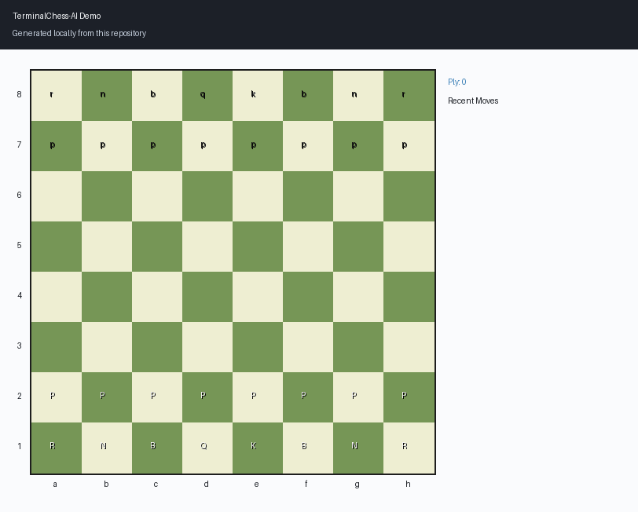

# TerminalChess-AI


TerminalChess-AI is a terminal-first chess engine written in C++ with configurable AI playstyles, reproducible runs, and a clean production-style project structure.



## Highlights
- Full legal move generation with castling, en passant, and promotion
- Endgame and draw handling: checkmate, fifty-move rule, threefold repetition
- Minimax with alpha-beta pruning
- AI style profiles (`balanced`, `aggressive`, `positional`)
- Deterministic execution through `--seed`
- Preset launch profiles for different match experiences

## Tech Stack
- C++17
- CMake
- Terminal runtime (Windows console APIs + ANSI/termios fallback)

## Quick Start
### Build with CMake
```bash
cmake -S . -B build -DCMAKE_BUILD_TYPE=Release
cmake --build build --config Release
```

### Run
```bash
./build/terminalchess_ai --help
```

On Windows with multi-config generators:
```powershell
.\build\Release\terminalchess_ai.exe --help
```

## Presets
| Preset | Description |
| --- | --- |
| `classic` | Neutral baseline configuration |
| `creator` | Personal default profile (human vs aggressive bot) |
| `duel` | High-focus bot-vs-bot benchmark setup |
| `chaos` | Random-heavy bot-vs-bot profile |

Examples:
```bash
./build/terminalchess_ai --preset creator
./build/terminalchess_ai --preset duel --seed 1337
./build/terminalchess_ai --mode pvb --bot-color black --black-style aggressive --black-difficulty 4
```

## CLI Reference
Core options:
- `--mode <pvp|pvb|bvb>`
- `--preset <classic|creator|duel|chaos>`
- `--white-style <balanced|aggressive|positional>`
- `--black-style <balanced|aggressive|positional>`
- `--white-difficulty <1-6>`
- `--black-difficulty <1-6>`
- `--seed <number>`
- `--no-profile`
- `--version`
- `--help`

## Repository Layout
- `include/chess_engine/chess.hpp`: models, interfaces, runtime configuration
- `src/chess.cpp`: board state, move validation, evaluation, terminal rendering
- `src/path_node.cpp`: minimax + alpha-beta search
- `src/bot.cpp`: bot profile and search orchestration
- `src/player.cpp`: player state and score handling
- `src/main.cpp`: CLI parser, presets, startup profile banner, game loop
- `docs/ARCHITECTURE.md`: architecture notes

## Quality and CI
- GitHub Actions CI builds on Windows and Ubuntu
- CTest smoke tests validate `--help` and `--version`
- `.editorconfig` enforces consistent formatting basics

## Security
See [SECURITY.md](SECURITY.md).

## Contributing
See [CONTRIBUTING.md](CONTRIBUTING.md).

## License
MIT License. See [LICENSE](LICENSE).
